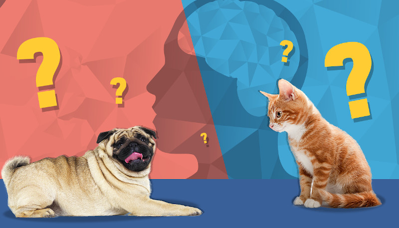

# **Deep Learning Classification**

Create an algorithm to classify whether images contain either a dog or a cat.

Its kind of teach a machine to detect a thing in object. To teach which is cat? and which is dog? to computer we are going to build a deep learning model, which could be very basic to far complex based on our level of accuracy required and computational resources available. For this notebook, we are using a dogs and cats dataset, in which collection of images of dogs and cats and our objective is to build a basic CNN and classify dogs and cats from image, based on feature learning in hidden layers and activation maps in CNN.

**The flow for this work?**

- Explore the dataset and attempt to make EDA of data
- preprocess the data as requried, this includes image augumentations, scaling and what else need?
- Build a basic vanilla CNN, and try to predict species as a binary classification problem
- Make predictions with transfer learning using ResNet50 and imagenet weights
- Compare the results on vanilla CNN and ResNet50 with sample data

[<u>**Jupyter code**</u>](Cats_vs_Dogs.ipynb)